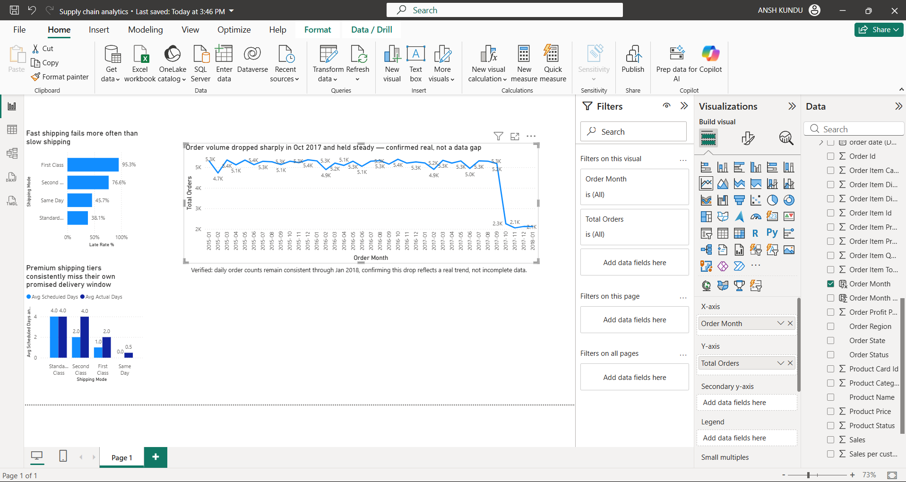

# Supply Chain Performance & Delivery Risk Analysis

## ❓ Business Question

Where in the supply chain are deliveries failing, and which shipping modes, 
regions, or product categories are driving the losses? Specifically: does 
faster shipping mode actually mean more late deliveries, and which categories 
are both unprofitable and unreliable?

## 📂 Data Source

DataCo Smart Supply Chain dataset (Kaggle), containing 180,519 real orders 
across 53 original columns, including shipping mode, delivery status, order 
region, product category, sales, profit ratio, and order/shipping dates 
(Jan 2015 – Jan 2018).

## 🛠️ Methodology

1. **Inspected** the raw dataset for nulls, duplicates, and structural issues
2. **Cleaned** the data: dropped two fully/mostly empty columns 
   (`Product Description` – 100% null, `Order Zipcode` – 86% null) and seven 
   irrelevant PII columns (customer email, password, name, street, etc.)
3. **Loaded** the cleaned data into SQLite and wrote 10 SQL queries covering 
   delivery performance, profit, discounting, and trend analysis
4. **Verified** an unexpected finding (a sharp drop in order volume from 
   Oct 2017) by checking daily order counts through the end of the dataset, 
   confirming it reflects a real trend rather than incomplete data
5. **Built** an interactive Power BI dashboard with 7 DAX measures and 
   3 visuals to communicate the findings

## 📌 Key Findings

1. **Faster shipping fails more, not less.** First Class shipping has a 
   95.3% late delivery rate, more than double Standard Class (38.1%). 
   Second Class sits at 76.6% — both premium tiers fail far more often 
   than the "slow" default option.

2. **The company is overpromising on its fast tiers.** First Class and 
   Second Class both take roughly double their own promised delivery 
   window on average (e.g. Second Class promises 2 days, actually takes 
   ~4). Standard Class has a delay gap of effectively zero — it delivers 
   exactly what it promises.

3. **Region barely matters — shipping mode is the real driver.** Late 
   delivery rate varies only 48–58% across all 22 regions (a 10-point 
   spread), compared to a 57-point spread across shipping modes. Any 
   delivery problem fix should target shipping mode policy, not 
   region-specific operations.

4. **Order volume dropped sharply and durably from October 2017.** Monthly 
   orders fell from ~5,300 to ~2,200 starting Oct 2017 and held at that 
   lower level through the end of the dataset (Jan 2018). This was verified 
   to be a genuine trend, not incomplete data — daily order counts in the 
   final month (Jan 2018) remain consistent at 68–69 orders/day throughout.

5. **Six product categories are both unprofitable and unreliable**: Pet 
   Supplies, Strength Training, As Seen on TV!, Books, Boxing & MMA, and 
   Hunting & Shooting all rank in the bottom 20 for profit ratio *and* the 
   top 15 for late delivery rate — these need operational review, not just 
   pricing review.

## ✅ Recommendations

- **Review SLA promises on First Class and Second Class shipping.** A 95% 
  failure rate on a "premium" tier likely damages customer trust more than 
  it adds value — either fix fulfillment capacity for these tiers or adjust 
  the promised delivery windows to match reality.
- **Don't prioritize region-specific delivery fixes.** The data shows this 
  would be the wrong lever — shipping mode policy is the actual driver.
- **Investigate the six overlapping categories** (low profit + high late 
  rate) for supplier or fulfillment issues specific to those product lines.
- **Investigate the cause of the October 2017 volume drop** with access to 
  business context not available in this dataset alone (e.g. a pricing 
  change, a supplier issue, or a market shift).

## 📊 Dashboard

## 🛠️ Tools Used
SQL (SQLite), Python (Pandas), Power BI Desktop